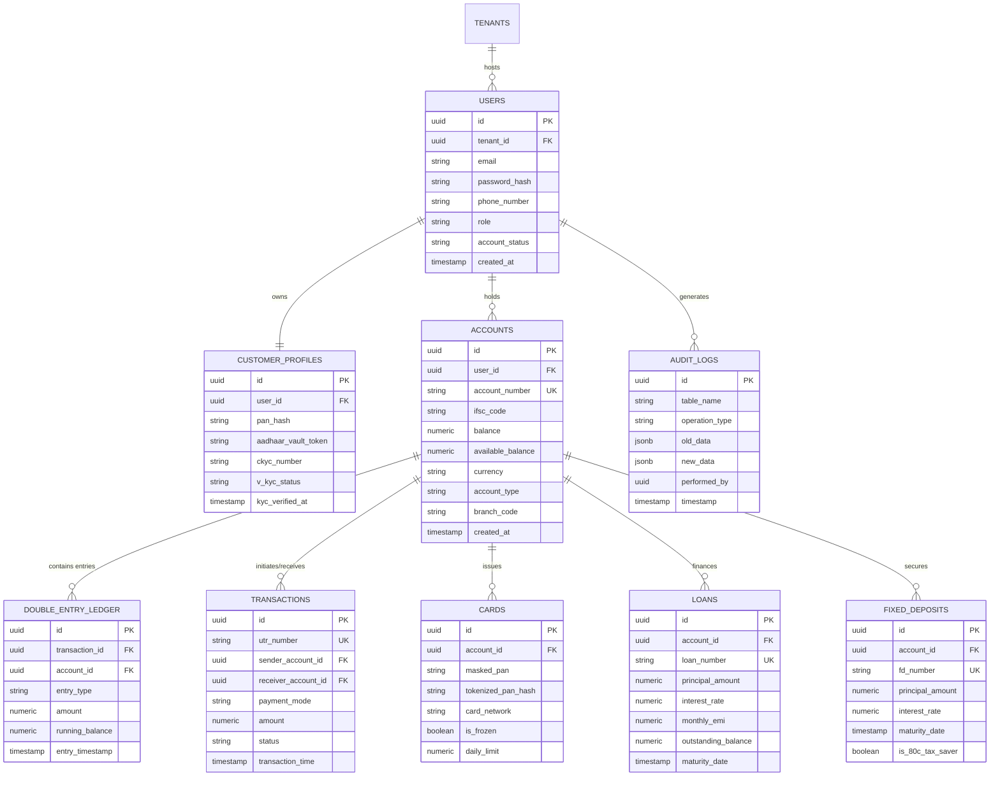

# SmartBank Bharat AI — Enterprise Core Banking Database Architecture

**Author**: Principal Database Architect & Financial Data Engine Board  
**Target RDBMS**: Supabase PostgreSQL 15+  
**Standards**: Double-Entry Accounting Invariants, ISO 20022 Financial Messaging, PCI-DSS Level 1 Data Masking  

---

## 1. High-Level Entity Relationship Diagram (ERD)



---

## 2. Table Specifications & Constraints Matrix

### Core Accounting & Financial Ledger Invariants
1. **Double-Entry Balance Rule**: Every financial event creates balanced debit and credit entries in `DOUBLE_ENTRY_LEDGER`. Sum of debits MUST equal sum of credits.
2. **Non-Negative Balance Constraint**: Savings accounts enforce `CHECK (balance >= 0)`. Overdraft/Current accounts enforce `CHECK (balance >= -max_overdraft_limit)`.

---

## 3. High-Velocity Partitioning Strategy

### Range Partitioning on Transactions & Ledger
To maintain sub-5 millisecond query performance across 500+ Million financial records:
- **`DOUBLE_ENTRY_LEDGER` Partition Key**: `entry_timestamp` (Monthly partitions: `ledger_y2026m01`, `ledger_y2026m02`, etc.).
- **`TRANSACTIONS` Partition Key**: `transaction_time` (Monthly partitions: `transactions_y2026m01`, etc.).

---

## 4. Supabase Row Level Security (RLS) Strategy

### RLS Access Policies

```
┌──────────────────────────────────────────────────────────────────────────────────────────────────┐
│                               SUPABASE RLS ACCESS CONTROL MATRIX                                 │
├───────────────────┬─────────────────────────────┬────────────────────────────────────────────────┤
│ Target Table      │ User Role Scope             │ Permitted Operation & RLS Condition            │
├───────────────────┼─────────────────────────────┼────────────────────────────────────────────────┤
│ ACCOUNTS          │ Retail Customer             │ SELECT WHERE user_id = auth.uid()              │
│ TRANSACTIONS      │ Retail Customer             │ SELECT WHERE sender_account_id IN (UserAccts)  │
│ CARDS             │ Retail Customer             │ SELECT/UPDATE WHERE account_id IN (UserAccts)  │
│ KYC_DOCUMENTS     │ Compliance Officer          │ SELECT/UPDATE WHERE role = 'COMPLIANCE'        │
│ AUDIT_LOGS        │ Super Admin                 │ SELECT ONLY (No UPDATE/DELETE Permitted)       │
└───────────────────┴─────────────────────────────┴────────────────────────────────────────────────┘
```

---

## 5. Audit Trail, History Tables & Soft Delete Strategy

1. **Change Data Capture (CDC) Audit Trigger**: Every `INSERT`, `UPDATE`, `DELETE` operation fires a trigger capturing `old_data` and `new_data` into immutable `AUDIT_LOGS`.
2. **Soft Delete Invariant**: Core financial records (`ACCOUNTS`, `USERS`, `CARDS`) are NEVER deleted physically. Soft deletion uses `deleted_at TIMESTAMP WITH TIME ZONE DEFAULT NULL` with partial indexes `WHERE deleted_at IS NULL`.

---

## 6. Zero-Downtime Migration Strategy

1. **Expand and Contract Pipeline**:
   - **Phase 1 (Expand)**: Add new non-null columns as NULLABLE or with DEFAULT values.
   - **Phase 2 (Dual Write)**: Update application layer to write to both old and new schema structures.
   - **Phase 3 (Backfill)**: Run background migration scripts to backfill historical records.
   - **Phase 4 (Contract)**: Remove old column references cleanly after zero-error verification.

---

*Master Database Architecture | SmartBank Bharat AI Data Engine Board*
